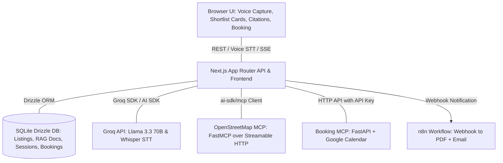

# NextLeap Property Scout — Voice-First AI Property Scout

Welcome to the **Voice-First AI Property Scout**, a companion dashboard and voice assistant designed to streamline the rental search process in Bengaluru. Using voice capture, LLM-orchestrated tools, OpenStreetMap data, and Google Calendar scheduling, this application enables users to discover, shortlist, and book site-visit slots for rental properties.

---

## 1. System Architecture

The application is built on Next.js and is architected to run as a suite of microservices deployed on Railway, utilizing a local SQLite database with Drizzle ORM.



### Component Breakdown
*   **Browser (UI)**: Features a push-to-talk mic button using the browser `MediaRecorder` API, a live transcript view, interactive shortlist cards, a neighborhood snapshot panel, citations panel, and a booking calendar panel. Audio responses are spoken client-side using browser `SpeechSynthesis`.
*   **Next.js Server (Orchestration & API)**:
    *   `/api/stt`: Transcribes browser audio blobs using Groq-hosted Whisper (`whisper-large-v3-turbo`).
    *   `/api/agent`: Orchestrator agent loop (using Vercel AI SDK + Groq `openai/gpt-oss-120b` tool calling).
    *   `/api/shortlist`, `/api/booking`, `/api/notify`: Session/shortlist state handlers and n8n webhook notification triggers.
*   **Database (SQLite)**: Drizzle ORM schema mapping SQLite (`better-sqlite3`) tables for `listings`, `neighborhood_docs`, `sessions`, `shortlist_items`, `tool_call_log`, and `bookings`.
*   **Embeddings**: Local, in-process embeddings generated via `@xenova/transformers` using the `Xenova/all-MiniLM-L6-v2` model (384-dimensions) to power semantic search over `neighborhood_docs`.
*   **n8n Workflow**: Runs on Railway from the official template, receiving active shortlist data, compiling it into a PDF, and emailing it using SMTP/Resend.

---

## 2. Setup & Installation

### Prerequisites
*   Node.js v18+
*   NPM or Yarn
*   A Groq API Key (for LLM and STT)
*   OSM MCP URL and Booking MCP credentials

### Environment Configuration
Create a `.env` or `.env.local` file in the root directory:
```env
GROQ_API_KEY=your_groq_api_key
DATABASE_URL=file:./data/nextleap.db
OSM_MCP_URL=https://osm-mcp.example.com
BOOKING_MCP_URL=https://booking-mcp.example.com
BOOKING_MCP_API_KEY=your_booking_mcp_secret_key
N8N_WEBHOOK_URL=https://n8n.example.com/webhook/shortlist-pdf
```

### Installation Steps

1.  **Install dependencies**:
    ```bash
    npm install
    ```
2.  **Initialize Database Schema**:
    Push the Drizzle schema to the local SQLite database file:
    ```bash
    npm run db:push
    ```
3.  **Scrape Listings**:
    Fetch available listings from bengaluru.rent:
    ```bash
    npm run scrape:listings
    ```
4.  **Ingest Neighborhood Documents**:
    Fetch, chunk, embed, and ingest neighborhood context pages from Wikipedia:
    ```bash
    npm run ingest:docs
    ```
5.  **Start Development Server**:
    Launch the Next.js development server:
    ```bash
    npm run dev
    ```

### Railway Deployment
The project includes a [railway.toml](file:///D:/NextLeap/Final%20Project/railway.toml) file that handles build and deployment steps automatically on Railway.
*   **Build**: Handled via Nixpacks (`npm run build`).
*   **Database Initialisation**: Runs `npm run db:push` automatically before launching `npm run start` to ensure your database schema is up-to-date.
*   **SQLite Persistence**: To persist SQLite data, make sure to attach a **Persistent Volume** to the Next.js service in the Railway UI and mount it to `/data`, setting the `DATABASE_URL` environment variable to `file:/data/nextleap.db`.

---

## 3. MCP Integration

Model Context Protocol (MCP) is integrated to supply verified, real-world geodata and booking schedules, bypassing model hallucinations.

### 3.1 OpenStreetMap (OSM) MCP
*   **Client Wiring**: Connected via `@ai-sdk/mcp`'s `createMCPClient({ transport: { type: 'http', url } })` pointing to a streamable HTTP transport `/mcp` on the deployed OSM service (which runs the official `mcp` Python SDK's FastMCP).
*   **Reused Sessions**: To reduce connect-discover handshakes (which cost ~4s per connection), the app opens a single session (`openOsmSession()`) to query multiple coordinates, cutting lookup latencies by up to 90%.
*   **Coordinate + Category Caching**: Because the Overpass API is slow and rate-limited, results are cached in-memory using rounded coordinates (4 decimal places) and category keys for 30 minutes.
*   **Offered Tools**:
    *   `find_nearby_places`: Groups places by `amenity` or `shop` categories.
    *   `analyze_neighborhood` / `find_schools_nearby`: Returns nearby POIs and schools.

### 3.2 Booking MCP (Google Calendar Scheduling)
*   **FastAPI Proxy**: Integrates with [Sowjanyakaki/MCP-server](https://github.com/Sowjanyakaki/MCP-server) via HTTP endpoints using an `X-API-Key` auth header.
*   **Scheduling Flow**:
    *   `listBookingSlots`: Fetches open slots matching weekday templates (10:00 or 15:00 IST).
    *   `createBookingHold`: Claims a tentative calendar slot with a unique generated booking code (e.g. `NL-D3F2`) and writes a record in the local `bookings` table.
    *   `cancelBookingHold`/`rescheduleBookingHold`: Mutates existing calendar appointments when requested by user voice commands.

---

## 4. Scraped Dataset (Collection & Cleaning)

Data pipeline execution runs offline or on-demand to populate listings and neighborhood context.

### 4.1 Listings Scraper (`scrape-listings.ts`)
*   **Source**: Fetches raw coordinates and listing details directly from bengaluru.rent's public Supabase edge function: `https://mpnjtkqklmwczowhodfh.supabase.co/functions/v1/get-pins`.
*   **Filters**: Removes listings marked "Not for rent" (`listing_type` is null), suspicious listings (`is_suspicious === true`), and pins with missing critical fields.
*   **PII Cleanup**: Employs a strict allowlist in `stripPII()` to extract only safe keys (`sourceUrl`, `societyName`, `locality`, `lat`, `lng`, `rent`, `bedrooms`, `furnishing`, `amenities`, `sqft`, `availabilityStatus`). Owner names, agents, and phone numbers are completely discarded in memory before hitting DB or logs.
*   **Locality Classification**: Map pin coordinates are mapped to the nearest default locality boundary (Koramangala, HSR Layout, Indiranagar, Whitefield, Jayanagar).

### 4.2 RAG Neighborhood Docs (`ingest-neighborhood-docs.ts`)
*   **Source**: Fetches plain-text Wikipedia pages per locality using Wikipedia's API (`explaintext=1`).
*   **Chunking**: Breaks text into ~500 word chunks.
*   **Embeddings**: Embeds chunks locally in-process using `@xenova/transformers` with `Xenova/all-MiniLM-L6-v2` (384-dimensional).
*   **Idempotency**: Re-ingesting a locality deletes previous docs for that locality first before writing new ones, preventing duplication.

---

## 5. How to Run Evals

The evaluation suite runs checks on database fixtures or session history. Evals print pass/fail results to stdout.

*   **Feasibility Check**:
    Checks if active shortlists conform to constraints (max budget, correct bedrooms, must-have amenities, and that commute calls match the session's stated commute point).
    ```bash
    npm run eval:feasibility -- --fixture evals/fixtures/feasibility-pass.json
    ```
*   **Edit Correctness Check**:
    Diffs before and after states of a shortlist, checking that an edit operation (e.g., `filter rent <= 40000`) only affected relevant listings and did not touch other rows.
    ```bash
    npm run eval:edit-correctness -- --fixture evals/fixtures/edit-correct.json
    ```
*   **Grounding Check**:
    LLM-assisted fact-checking. Inspects transcript claims to assert that every neighborhood statement is backed by a valid citation and matching source text, while tolerating declared uncertainty ("I don't have reliable transit data").
    ```bash
    npm run eval:grounding -- --fixture evals/fixtures/grounding-fully-grounded.json
    ```
*   **Run All Evals**:
    ```bash
    npm run eval:all
    ```
*   **Unit Tests**:
    ```bash
    npm test
    ```

---

## 6. Sample Test Transcripts & Payload Examples

### 6.1 Sample Grounding Transcript (with RAG Citations)
Below is a sample of a grounding transcript payload where neighborhood facts are backed by Wikipedia citations:

```json
{
  "transcript": [
    { 
      "role": "user", 
      "content": "What is the neighborhood like around Green Meadows?" 
    },
    {
      "role": "assistant",
      "content": "Koramangala is well known for its dense concentration of cafes and tech offices, and the main roads near Green Meadows are well-lit and considered safe for evening pedestrian traffic.",
      "citations": [
        {
          "sourceTitle": "Koramangala - Wikipedia",
          "sourceUrl": "https://en.wikipedia.org/wiki/Koramangala",
          "chunkText": "Koramangala is a residential and commercial neighbourhood in Bengaluru known for its cafes, tech startup offices, and well-lit main roads, generally considered safe for evening pedestrian traffic."
        }
      ]
    }
  ]
}
```

### 6.2 Sample Shortlist Edit Payload (Edit Correctness)
Below is an example of an edit event. When a user requests to filter properties, the agent applies an edit transaction:

```json
{
  "editLogEntry": {
    "input": { 
      "op": "filter", 
      "field": "rent", 
      "comparator": "<=", 
      "value": 40000 
    },
    "output": { 
      "changed": [2], 
      "unchanged": [1, 4] 
    }
  }
}
```